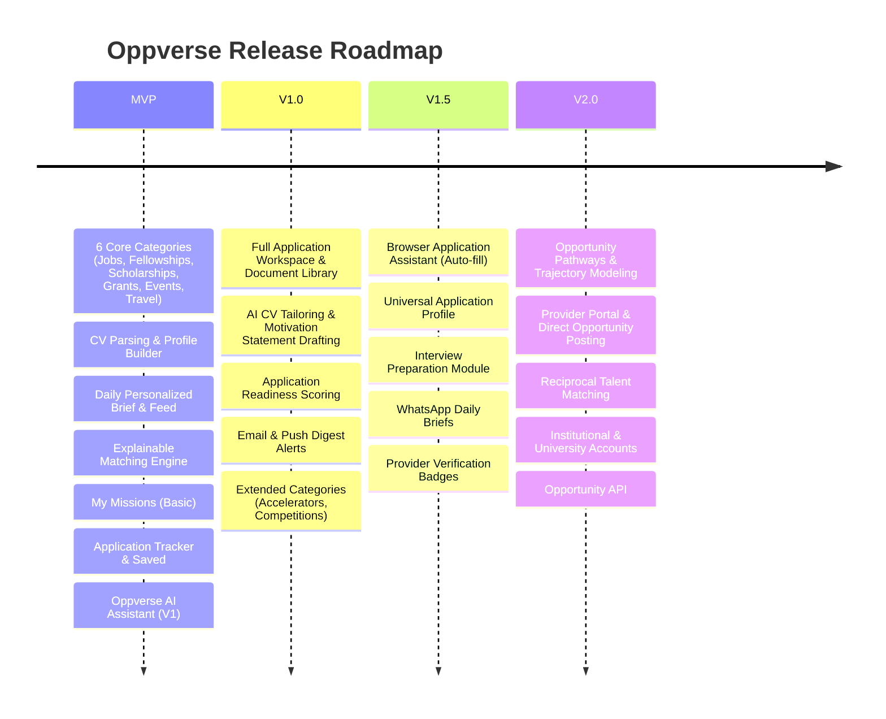

# OPPVERSE PRODUCT REQUIREMENTS DOCUMENT

- **Version:** 1.0
- **Status:** Product Definition
- **Prepared by:** Tomide Williams
- **Preparation Date:** 1 September 2026

---

## 1. PRODUCT OVERVIEW

Oppverse is an AI-powered opportunity intelligence platform that continuously discovers, understands, ranks and recommends opportunities based on who a person is, what they have done, what they are eligible for and where they want to go.

Oppverse brings opportunities that currently live across hundreds of websites, job boards, newsletters, social platforms, communities, institutional websites and databases into one personalized universe.

### Initial Opportunity Universe
- Jobs
- Internships
- Fellowships
- Scholarships
- Grants
- Travel Opportunities
- Conferences
- Events
- Competitions
- Awards
- Accelerators
- Startup Programs
- Training Programs
- Volunteer Opportunities
- Speaking Opportunities
- Research Opportunities
- Professional Programs

### Core Product Journey
$$\text{Build Profile} \longrightarrow \text{Understand Goals} \longrightarrow \text{Discover Opportunities} \longrightarrow \text{Rank Fit} \longrightarrow \text{Explain Why} \longrightarrow \text{Prepare} \longrightarrow \text{Apply} \longrightarrow \text{Track} \longrightarrow \text{Learn} \longrightarrow \text{Recommend Better Opportunities}$$

Oppverse should not behave like a conventional opportunity directory. The user should not need to search through thousands of opportunities every day.

**Instead:**
- Oppverse searches for the user.
- The product should understand the user well enough that opening Oppverse feels like opening a personalized universe of possibilities.

---

## 2. PRODUCT THESIS

The internet does not have an **Opportunity Shortage**.
It has an:
1. **Opportunity Discovery Problem**
2. **Relevance Problem**
3. **Execution Problem**

### The Fragmentation Problem
- Jobs on company career pages
- Scholarships on university websites
- Fellowships on foundation websites
- Grants on NGO and government portals
- Conferences on event websites
- Travel opportunities hidden inside fellowship programs
- Accelerators in startup ecosystems
- Competitions announced on social media
- UN opportunities spread across multiple institutional systems
- Professional programs inside newsletters
- Speaking opportunities on conference websites

Many potentially life-changing opportunities are fragmented across places the average person does not consistently monitor.

Existing opportunity platforms help primarily by collecting opportunities. But aggregation alone still leaves the user with another problem:
> *"Which of these thousands of opportunities actually makes sense for me?"*

Oppverse solves that problem.

### Central Thesis
**One profile should power a person's entire opportunity universe.**

Instead of repeatedly searching:
- *"Remote product marketing jobs"*
- *"Fellowships for Nigerians"*
- *"Fully funded conferences"*
- *"Scholarships for Africans"*
- *"Startup grants"*
- *"Speaking opportunities"*

The user tells Oppverse who they are and where they want to go. Oppverse continuously searches, evaluates, and organizes opportunities around them.

---

## 3. CORE PRODUCT PROMISE

> **"Your opportunities should find you."**

### Supporting Propositions
- **Primary:** Oppverse learns who you are and continuously finds the jobs, fellowships, scholarships, grants, events, programs and opportunities worth your attention.
- **Alternative:** *One profile. A universe of opportunities.* Oppverse turns your experience, interests, and ambitions into a personalized opportunity feed that gets better as it learns from you.

---

## 4. INITIAL CUSTOMER

- **Core Target:** Ambitious African professionals, students, founders, and young people actively looking for career, education, funding, and global opportunities.
- **Initial Geographic Focus:**
  - Nigeria
  - Ghana
  - Kenya
  - Rwanda
  - South Africa
  - Uganda
  - Other African markets
- **Architecture Consideration:** The product architecture must support global opportunities and eventual global users.

---

## 5. PRIMARY USER SEGMENTS

| Segment | Target Opportunities |
| :--- | :--- |
| **Early-Career Professionals** | Jobs, Graduate programs, Fellowships, Professional programs, Conferences, Training, Travel opportunities |
| **Students & Graduates** | Scholarships, Internships, Graduate programs, Fellowships, Competitions, Research opportunities, Study-abroad opportunities |
| **Mid-Career Professionals** | International jobs, Leadership fellowships, Executive programs, Speaking opportunities, Conferences, Awards, Professional networks |
| **Founders** | Grants, Accelerators, Startup competitions, Funding programs, Founder fellowships, Conferences, Travel programs, Pitch opportunities |
| **Researchers & Academics** | Research grants, Fellowships, Scholarships, Conferences, Visiting programs, Research positions, Calls for papers |
| **Creatives & Independents** | Residencies, Grants, Awards, Competitions, Speaking opportunities, Fellowships, International programs |

---

## 6. CUSTOMER PROBLEM — THE DISCOVERY HEADACHE

The user currently has to manually monitor dozens of channels:
- LinkedIn, Google, Job boards
- Opportunity Desk, Opportunities for Africans
- University websites, Company career pages, Foundation websites
- Government portals, UN websites, Event platforms
- WhatsApp groups, Telegram channels, Newsletters, X (Twitter)
- Community groups, Startup platforms, Accelerators, Conference websites

Even after doing all this, they still do not know whether they have seen the best opportunities available to them.

---

## 7. CUSTOMER PROBLEM — INFORMATION OVERLOAD

Finding more opportunities is not automatically valuable.
- A page containing 700 scholarships creates work.
- A newsletter containing 50 fellowships creates work.
- A job board containing 20,000 jobs creates work.

The user still has to determine:
- Am I eligible?
- Is this relevant?
- Can someone from my country apply?
- Does my experience fit?
- Is it funded? Can I afford the application?
- Is relocation required? Do they sponsor visas?
- Does this align with my career?
- How much effort will this application require?
- When does it close? Is this actually worth pursuing?

**Oppverse performs this evaluation before presenting the opportunity prominently.**

---

## 8. CUSTOMER PROBLEM — PEOPLE DON'T KNOW WHAT TO SEARCH FOR

People can only search for opportunities they already know exist.

A user may search:
- *"Product marketing jobs"*

...but never search for:
- *"Emerging leader fellowship"*
- *"Conference travel grant"*
- *"Fully funded policy program"*
- *"Startup residency"*
- *"Call for speakers"*
- *"Professional exchange"*
- *"International leadership programme"*
- *"Visiting fellowship"*

...yet one of those opportunities could materially transform their trajectory.

Therefore Oppverse supports:
1. **Intentional Discovery:** Opportunities matching what the user explicitly wants.
2. **Serendipitous Discovery:** High-impact opportunities the user did not know to search for, but which strongly align with their profile and goals.

---

## 9. CUSTOMER PROBLEM — DISCOVERY DOES NOT EQUAL SUCCESS

- Finding a scholarship does not win the scholarship.
- Finding a job does not get the job.
- Finding a fellowship does not complete the application.

After discovery, the user still needs to:
- Understand requirements
- Gather documents & tailor CV
- Write essays & answer custom questions
- Secure recommendations & prepare a portfolio
- Meet deadlines & prepare for interviews
- Track outcomes

**Oppverse owns the full lifecycle:**
$$\text{Discovery} \longrightarrow \text{Decision} \longrightarrow \text{Preparation} \longrightarrow \text{Application} \longrightarrow \text{Outcome}$$
*(Not merely: Discovery $\rightarrow$ External Link)*

---

## 10. COMPETITIVE LANDSCAPE

Oppverse sits across several existing product categories. Rather than cloning a single competitor, Oppverse combines the strongest mechanics from each:

- **Opportunity Desk:** Proves demand for a multi-category opportunity universe (jobs, fellowships, scholarships, grants, conferences, awards).
- **Opportunities for Africans:** Proves that geography and eligibility criteria matter enormously. Eligibility must be a first-class data layer.
- **Simplify:** Demonstrates the power of "One Profile" powering personalized discovery, application auto-fill, and structured tracking. Oppverse expands this from jobs to all opportunity types.
- **Handshake:** Demonstrates adaptive recommendations that learn from user behavior (saves, clicks, dismissals, applications).
- **Wellfound:** Shows the value of reciprocal discovery (people finding opportunities, and eventually opportunity providers finding vetted talent).
- **F6S:** Shows how multiple opportunity types (grants, accelerators, competitions, jobs) can share a single identity layer for founders.
- **ProFellow:** Proves the need for specialized metadata schemas for fellowships and funded programs (stipends, residency, visa support).

### Oppverse's Core Differentiation
Most platforms start with **Opportunity $\rightarrow$ Find People** or **Database $\rightarrow$ User Searches**.  
Oppverse starts with: **Person $\rightarrow$ Build Their Universe.**

---

## 11. PRODUCT ARCHITECTURE: THE SEVEN MAJOR ENGINES

1. **Identity Engine:** Who are you? (Skills, background, credentials, demographics, portfolio)
2. **Goal Engine:** Where are you trying to go? (Target roles, education, funding, speaking)
3. **Discovery Engine:** What opportunities exist? (Ingestion, structured extraction, verification)
4. **Matching Engine:** Which opportunities genuinely fit you? (Eligibility, relevance, strategic value, explainable AI)
5. **Opportunity Agent:** What should we continuously search for on your behalf? (Persistent Missions)
6. **Application Engine:** How do we help you prepare and apply? (Checklists, document library, AI drafting)
7. **Learning Engine:** What do your actions and outcomes teach Oppverse? (Implicit + explicit feedback loops)

$$\text{All 7 Engines feed into: } \mathbf{The\ Oppverse\ Opportunity\ Graph}$$

---

## 12. CORE NAVIGATION & MODULES

### Navigation Structure
- **Home:** Your personalized opportunity universe & daily brief
- **Discover:** Search, filter, and explore all opportunity universes
- **My Missions:** Persistent, autonomous AI opportunity searches
- **Saved:** Bookmarked opportunities under consideration
- **Applications:** Structured pipeline tracker (Saved $\rightarrow$ Preparing $\rightarrow$ Applied $\rightarrow$ Won)
- **Oppverse AI:** Conversational opportunity agent & advisor
- **Profile:** Identity, personas, goals, and matching preferences
- **Documents (Later):** Reusable CVs, essays, portfolios, and application materials

---

## 13. MODULE SPECIFICATIONS

### Module 1: Opportunity Profile & Personas
- **Fast Onboarding:** Upload CV $\rightarrow$ AI parses experience, education, skills, achievements $\rightarrow$ user verifies.
- **Enrichment Sources:** LinkedIn, Portfolio, GitHub, Google Scholar, Startup website.
- **Eligibility Data:** Citizenship, country of residence, age range (when required), education level, years of experience.
- **Opportunity Personas:** One user can maintain multiple active personas (e.g., *Tomide the PMM*, *Tomide the Founder*, *Tomide the Speaker*).
- **Explainable Profile Strength:** e.g., *"Profile Strength: 76% — Adding your citizenship unlocks accurate scholarship & fellowship eligibility screening."*

### Module 2: Home & Daily Opportunity Brief
- **Daily Brief:** *"Good morning, Tomide. We found 34 new opportunities. 3 Strong Matches we think you should act on today."*
- **Feed Sections:**
  - Best Matches (highest overall fit)
  - New Today (freshly ingested)
  - Closing Soon (approaching deadline)
  - Fully Funded (verified 100% funding)
  - High Value (transformational prestige/impact)
  - You Might Not Have Considered (serendipity engine)
  - Easy to Pursue (quick application complexity)
  - Trending in Your Field

### Module 3: Discovery & Ingestion Engine
- **Source Prioritization:** Primary official sources (UN, university, company career page) prioritized over secondary aggregators.
- **Canonical Deduplication:** Merges multiple listings across platforms into a single canonical record.
- **Verification States:** `Verified`, `Recently Checked`, `Unverified`, `Expired`, `Closed`, `Changed`.
- **Universal Opportunity Schema:** Title, Provider, Category, Geography, Remote/Physical, Opening Date, Deadline, Application URL, Eligibility, Benefits, Funding Status, Costs, Required Documents, Experience Level, Complexity.
- **Specialized Schemas:** Custom metadata for Jobs, Scholarships, Fellowships, Grants, Travel, Events, Accelerators.

### Module 4: Explainable Matching Engine
- **Match Dimensions:** Eligibility, Relevance, Goal Alignment, Experience Fit, Skill Fit, Geography Fit, Financial Fit, Timing Fit, Strategic Value.
- **Match Labels:** `Exceptional Match`, `Strong Match`, `Good Match`, `Worth Exploring`, `Low Fit`, `Not Eligible`.
- **"Why This Matches You" Breakdown:** Clear, readable bullet points explaining fit, funding, and watch-outs.
- **Strict Eligibility Separation:** Ineligibility immediately flags `Not Eligible` with reason, preventing wasted effort.
- **Uncertainty Principle:** If criteria are ambiguous, displays `Eligibility Unclear` + `[Check Official Source]`. Never fabricates eligibility.
- **Effort Estimation:** `Quick` (CV + form), `Moderate` (statement + questions), `Heavy` (proposal + references + essays).
- **Action Priority:** `Apply Now`, `Prepare This Week`, `Worth Exploring`, `Save for Later`, `Skip`.

### Module 5: My Missions (Autonomous Searches)
- Persistent instructions to Oppverse (e.g., *"Find senior remote PMM roles hiring from Nigeria"*, *"Find fully funded AI leadership fellowships in Europe"*).
- Configurable filters: funding, geography, deadline, effort, notification frequency.
- Conversational Mission creation via Oppverse AI.

### Module 6: Serendipity Engine
- Surfaces non-obvious, high-potential opportunities outside explicit searches.
- *"You Didn't Search for This, But..."* — Trains on user feedback (`Interesting`, `Not for me`, `More like this`, `Less like this`).

### Module 7: Opportunity Detail & Readiness
- Summary: What is this? Why it matters. Why you're seeing it.
- Eligibility checklist with verified criteria.
- **Opportunity Readiness Score:** e.g., *"72% Ready — Ready: CV, Passport, Bio. Missing: Motivation statement, 2 references."* $\rightarrow$ `Get Application Ready`.

### Module 8: Application Workspace & Tracker
- Workspace per pursued opportunity: Deadlines, checklist tasks, notes, document attachments.
- **Document Library:** Master CV, Academic CV, bio, headshot, portfolio, passport, transcripts, pitch decks.
- **AI Application Assistant:** Requirements analysis, CV tailoring suggestions, essay brainstorming, and question structuring grounded strictly in user's real experience (never hallucinates achievements).
- **Pipeline Tracker:** `Discovered` $\rightarrow$ `Saved` $\rightarrow$ `Preparing` $\rightarrow$ `Ready` $\rightarrow$ `Applied` $\rightarrow$ `Interview` $\rightarrow$ `Shortlisted` $\rightarrow$ `Offer / Won` $\rightarrow$ `Rejected / Withdrawn / Expired`.

### Module 9: Oppverse AI Assistant
- Conversational assistant powered by the Opportunity Graph.
- Handles queries: *"What are my best opportunities today?"*, *"Find grants for my startup"*, *"Create an application checklist for the Berlin Fellowship"*.
- Multi-channel brief delivery: Web app, Email, Push notifications (later: WhatsApp).

---

## 14. TRUST, SAFETY & SCAM DETECTION

- **Scam Detection Signals:** Unverified provider domains, suspicious application fees, conflicting org details, reported listings.
- **Risk Badges:** Clear `Potential Risk` warnings with supporting evidence.
- **Admin Curation Console:** Internal moderation dashboard to review ingested items, verify sources, merge duplicates, correct deadlines/eligibility, and approve canonical records.

---

## 15. MONETIZATION STRATEGY

### Consumer Model (Oppverse Pro)
- **Free:** Opportunity profile, personalized feed, basic matching, limited missions, saving, basic alerts.
- **Pro:** Advanced missions, deep match intelligence & readiness scoring, AI application drafting/tailoring, unlimited tracking, priority deadline alerts.

### Provider Model (Long-Term)
- Verified provider accounts, featured listings, candidate matching, talent discovery, university/institutional partnerships.
- **Ethical Boundary:** Strict separation between sponsored listings and algorithmic match fit. Sponsored items are explicitly labeled; ranking is never pay-to-win.

---

## 16. RELEASE ROADMAP

---

## 17. SUCCESS METRICS & NORTH STAR

### North Star Metric
$$\mathbf{Qualified\ Opportunity\ Pursuits\ Per\ Active\ User\ (QOPPU)}$$
*(Defined as: A user saves for action, starts preparing, or applies to a sufficiently matched recommendation).*

### Supporting Ultimate Outcome
- **Opportunities Won Through Oppverse** (Jobs landed, scholarships won, grants received, fellowships accepted).

### Key Product & Match Quality Metrics
- Profile Completion Rate
- Time to First Strong Match
- Daily Brief Open & Engagement Rate
- Strong Match $\rightarrow$ Save Rate ($\ge 35\%$)
- Strong Match $\rightarrow$ Application Rate
- Dismissal Rate by Reason (False Eligibility, Bad Relevance, Low Funding)
- False Eligibility Error Rate ($< 2\%$)
- Duplicate Listing Rate ($< 1\%$)
- 30-Day & 90-Day Retention

---

## 18. BRAND & POSITIONING

- **Core Brand Identity:** OP + VERSE = Opportunity Universe.
- **Brand Essence:** Possibility, discovery, ambition, upward mobility, global access.
- **Positioning Statement:**
  > *"Your opportunities should find you. Build your profile once. Oppverse continuously searches the world for opportunities that fit who you are and where you're going."*
